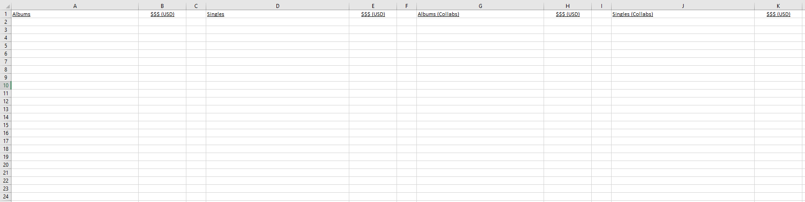
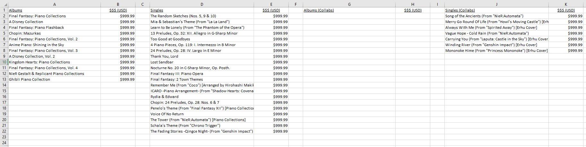
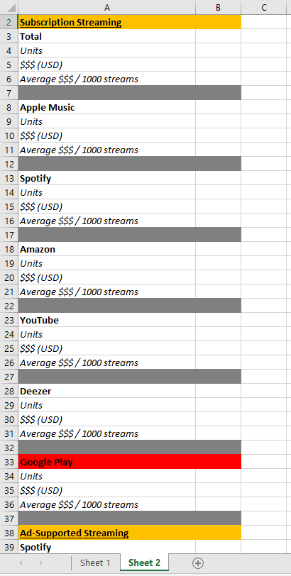
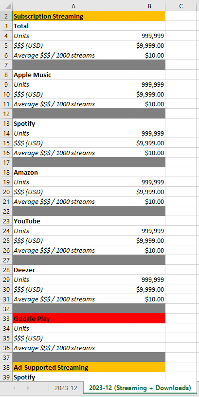

Soundrop Reports
================

Intro
-----
[I'm a pianist](https://open.spotify.com/artist/6mdGjVrAY95ecXnVgtefti) with music distributed by Soundrop. Every month, Soundrop sends a comprehensive CSV revenue report where I will filter and copy data that I'm particularly interested in onto an existing separate Excel spreadsheet. However, as my music catalog grew over the years, this manual process started becoming very time-consuming.

One of the reasons I picked up coding in July 2023 was so that I can write scripts to automate tedious / time-consuming tasks. So naturally, this was one of the first few projects I coded.

The Process
-----------
An Excel file template containing 2 sheet tabs is created (available in template folder). This is the file that gets written on by the scripts. Subsequent runs will simply overwrite.

The regular monthly process looks like this:
1. Change `statement_period` variable in settings.py to the current reporting month (eg. '2024-01').
2. Save the given CSV file in the same directory as previous CSV files as `statement_period`.csv (eg. 2024-01.csv).
3. Run [Update_Album_Sales_Report.py](Update_Album_Sales_Report.py).
4. Run [Update_Album_Sales_Report2.py](Update_Album_Sales_Report2.py).

Update_Album_Sales_Report.py turns this...

into this...

And Update_Album_Sales_Report2.py...

 

5. Make a few copy-pastes from this to the separate Excel spreadsheet mentioned in the intro.
6. Save the file and that's it!

Besides writing data, the scripts also print out other info such as total revenue and after-tax income for example (So I can see my 💸💸💸 immediately upon receiving the CSV file! 🤑).

Extra Thoughts
--------------
- I did not use Excel's pivot table for the first script because I wanted the release titles to be in chronological order of their release dates, and for some reason this data isn't available in the CSV file. This is also the reason I've decided to hard code the ordering of the release titles.

- And.. This is my very first repo! Yes, I had only starting learning Git a week ago! 😃

#### Notable libraries I used / learned for this project:
- pandas
- openpyxl
